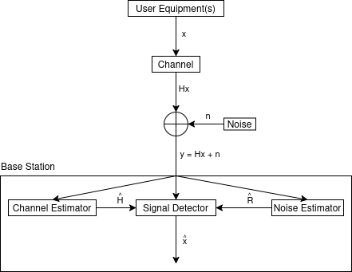
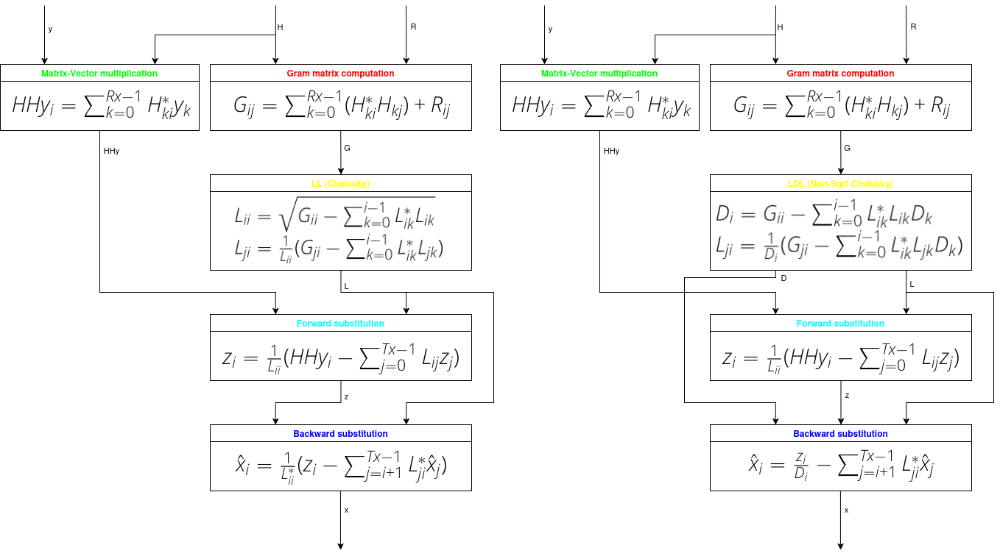

# MMSE on RISC-V

Linear Minimum Mean Squared Error (MMSE) Multiple Input Multiple Output (MIMO) detector for RISC-V with support for "V" Vector Extension based on Cholesky decomposition. Supports [ARA](https://www.github.com/pulp-platform/ara) and baremetal. Implements fixed- and floating-point solutions (LDL and LL Cholesky decompositions respectively). Vectorizes along the subcarriers dimension.

## Key Concepts

Multiple user antennas transmit data (`x`) to a base station equiped with multiple receiving antennas. Application of a multiplexing channel `H` and noise `n` yields a received signal vector `y`. Channel and noise estimators support with the channel matrix `H` and a noise covariance matrix `R`. This program implements a detector that approximates `x` from `y`, `H` and `R`.



### Definitions

- `NUM_RX` - number of receiving antennas.
- `NUM_TX` - number of transmitting antennas.
- `NUM_SC` - number of subcarriers.
- `x` - transmitted signal.
- `y` - received signal.
- `H` - multiplexing channel matrix.
- `n` - noise vector on the receiving antennas.
- `R` - noise covariance matrix.

### Method

Find such `x` that `x = G^{-1} H^H y` where G is a Gram matrix defined as `G = (H^H H + R)` and `H^H` is a Hermittian transpose of `H`. This is done in 5 steps:
- `cmatgram`: Calculate `G = H^H H + R`
- `ccholesky`: Perform Cholesky decomposition (`G=LL^H` or `G=LDL^H`)
- `cmatvecmul`: Multiply `H^H` and `y` (`HHy=H^H y`)
- `cforwardsub`: Perform forward substitution to find such `z` that `Lz=HHy`
- `cbackwardsub`: Perform backward substitution to find such `x` that `z=L^H x` (or `D^{-1} z = L^H x` in case of LDL Cholesky)

The following data flow diagrams demonstrate element-wise formulas for both LL and LDL based detection:


## Structure

Each of the five operations is implemented in its source file in `src`. `main.c` contains memory intialization and cycles measurments for each function.

`scripts/gen_data.py` generates `x`, `H`, `R` and `n` in `data` directory. `re` and `im` in the names mean real and imaginary parts. Then the data is loaded diectly into the program memory compile-time in `main.c` (thanks to [ChaN](https://elm-chan.org/junk/32bit/binclude.html) for sharing the macro).

## Configuration

Compile by passing configuration parameters to make:

```
$ make help

Usage:
  make [ARCH=<arch>] [DATA_TYPE=<type>] [PLATFORM=<platform>] [NUM_RX=<num_rx>] [NUM_TX=<num_tx>] [NUM_SC=<num_sc>]

Supported ARCH values:
  - x86 (default)
  - rv
  - rvv

Supported DATA_TYPE values:
  - float (default)
  - fixed

Supported PLATFORM values:
  - linux (default)
  - ara
  - baremetal

Supported NUM_RX values: integers > 0 (default = 4)
Supported NUM_TX values: integers > 0 (default = 4)
Supported NUM_SC values: integers > 0 (default = 1024)
```

- `ARCH`:
  - `x86` - (x86-64) for testing purposes. Sequential solution, no vectorization.
  - `rv` - RISC-V 64 (rv64) without "V" extension. Sequential solution, no vectorization. 
  - `rvv` - rv64v. Vectorized solution.
- `DATA_TYPE`:
  - `float` - all the data and computation is done with `float`. Requires "F" extension. Uses LL Cholesky.
  - `fixed` - Q31 fixed-point. Uses LDL Cholesky.
- `PLATFORM` - this parameter currently only affects `printf`:
  - `linux` - `printf` from `<stdio.h>`
  - `ara` - ARA's `printf` from `apps/common`. Assumes the repository is in the `apps` directory`.
  - `baremental` - simple UART printf strictly to output the cycles as used in `main.c`. **NOT IMPLEMENTED YET**.

Running `make` with the given parameters will create `build` directory and an `.elf` with the parameters in its name.
